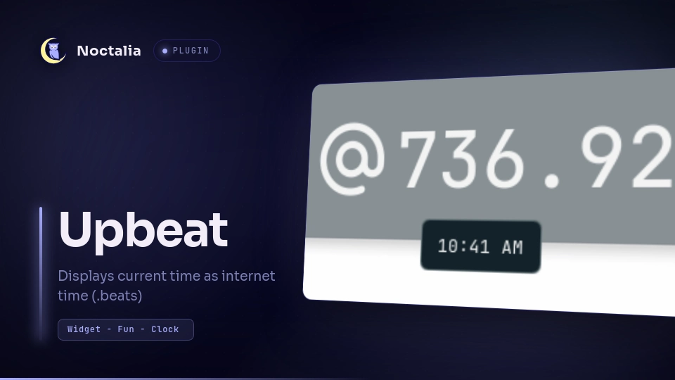

<h1>Upbeat</h1>

 
<strong>Upbeat</strong> is a bar widget plugin written for Noctalia (v5) that displays the current Internet Time. i believe that .beats are the best, and a subversive, yet extremely accurate and location agnostic way of telling time is objectively best. also it's kinda funny. 
 
<h2>Installation</h2>
the Noctalia plugin project is currently a work in progress and not available to the public as of current (6/20/2026). when it is available, Upbeat will be loaded into the community database. 
 
if you'd like to install the plugin directly, you can clone this repository and add the directory as a source in the plugins panel inside of Noctalia Settings.  
